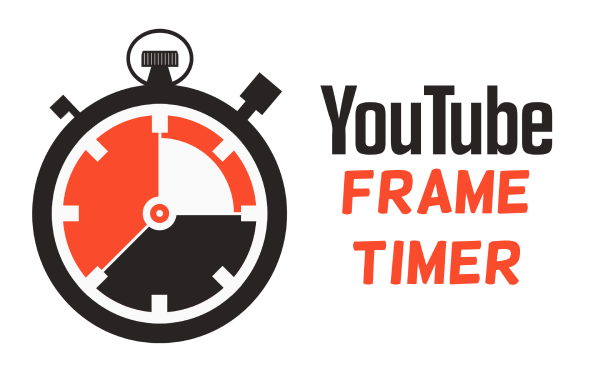

# Youtube Frame Timer
Youtube Frame Timer is a tool for moderators who need to retime Speedruns. This tool is optimized to readjust the timing in a simple and efficient manner.
At this time, we provide a [Chrome Extension](Chromeextension) and a [Firefox Addon](firefoxaddon).